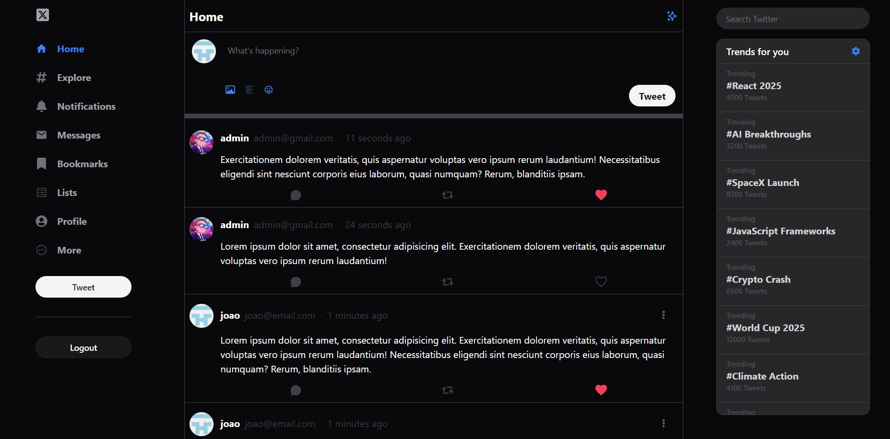
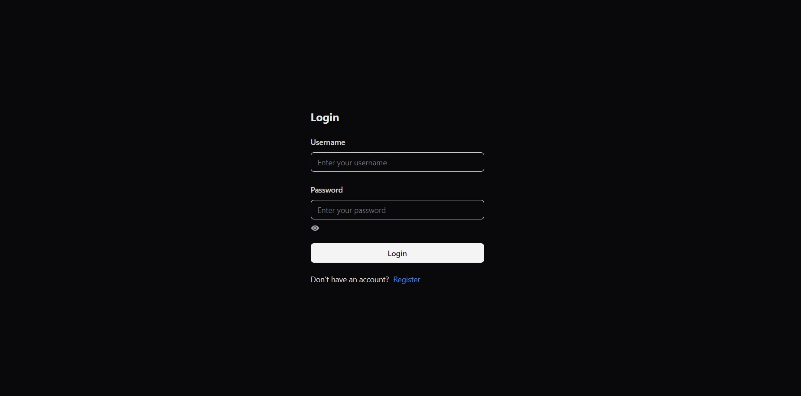
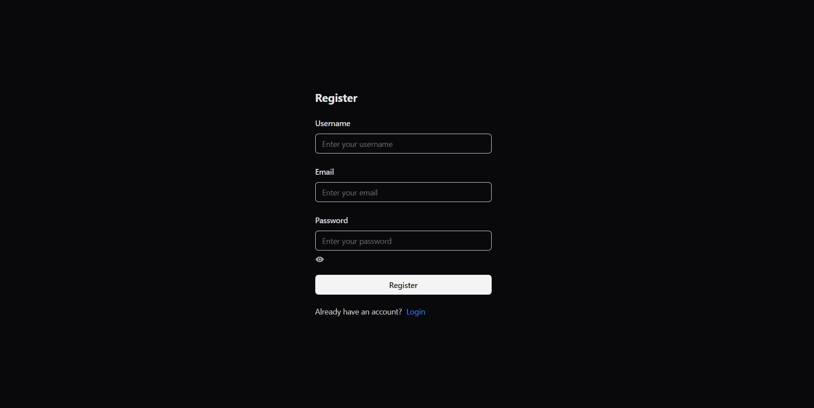

# Twitter Clone Fullstack

Este é um projeto Fullstack que simula funcionalidades de um sistema semelhante ao Twitter. O objetivo é explorar o desenvolvimento de um sistema completo com autenticação, gerenciamento de usuários, criação e manipulação de tweets, e interface moderna utilizando tecnologias atuais.

## Tecnologias Utilizadas

### Backend

- **Java Spring Boot**: Framework utilizado para a construção da API REST.
- **JWT (JSON Web Tokens)**: Para autenticação e geração de tokens.
- **Criptografia de Senhas**: Implementada para garantir segurança.
- **Controle de Roles**: Usuários possuem permissões específicas baseadas em suas roles.
- **Tratamento de Exceções**: A API é robusta e preparada para lidar com erros.

### Frontend

- **Vite**: Build tool para desenvolvimento rápido e eficiente.
- **TypeScript**: Linguagem utilizada para tipagem estática no frontend.
- **Tailwind CSS e ShadCN**: Estilização otimizada e modular para desenvolvimento rápido.
- **Autenticação de Rotas**: Proteção das rotas baseada nos tokens JWT fornecidos pelo backend.

### Banco de Dados

- **MySQL**: Banco de dados relacional utilizado para armazenamento de dados de usuários, tweets e interações.

## Funcionalidades

- **Cadastro e Login de Usuários**: Sistema de autenticação utilizando tokens JWT.
- **Criação e Exclusão de Tweets**: Usuários podem criar e deletar seus próprios tweets.
- **Interações nos Tweets**: É possível dar like ou dislike em tweets.
- **Roles de Usuário**: Diferentes níveis de permissões baseados na role do usuário.
- **Autenticação e Autorização**: Proteção de rotas no backend e frontend para garantir a segurança do sistema.
- **Interface Intuitiva**: Desenvolvida com foco em design moderno e usabilidade.

## Estrutura do Projeto

### Backend

- API RESTful desenvolvida em Java Spring Boot.
- Endpoints protegidos com autenticação JWT.
- Banco de dados MySQL integrado para persistência de dados.
- Controle de exceções e mensagens de erro padronizadas.

### Frontend

- Interface moderna criada com Vite e TypeScript.
- Uso de Tailwind CSS e ShadCN para estilização.
- Três páginas principais:
  - **Home**: Exibição de tweets.
  - **Login**: Tela de login para autenticação.
  - **Register**: Tela para registro de novos usuários.

## Imagens do Sistema

### Home

### Login

### Register

## Como Executar o Projeto

### Configuração do Backend

1. Clone o repositório.
2. Configure o arquivo `application.properties` no backend para conectar ao seu banco de dados MySQL.
3. Inicie o servidor executando o seguinte comando na raiz do projeto backend:
   `./mvnw spring-boot:run`. Certifique-se de que o banco de dados MySQL esteja ativo e configurado corretamente.

### Configuração do Frontend

1. Navegue até a pasta do frontend:
   `   cd client/twitter-project`
2. Instale as dependências:
   `npm install`

3. Inicie o servidor de desenvolvimento:
   `npm run dev`

4. Acesse a aplicação no navegador pelo endereço exibido no terminal.
